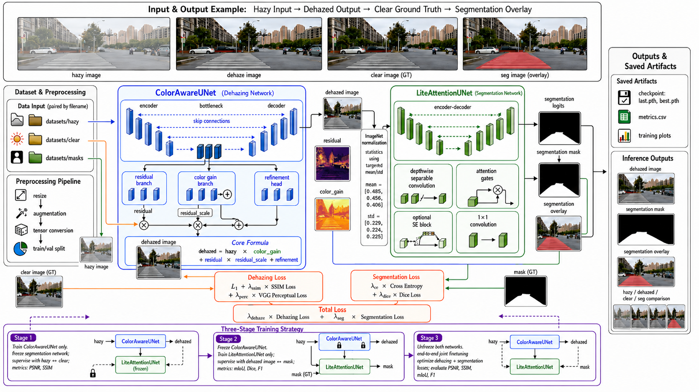
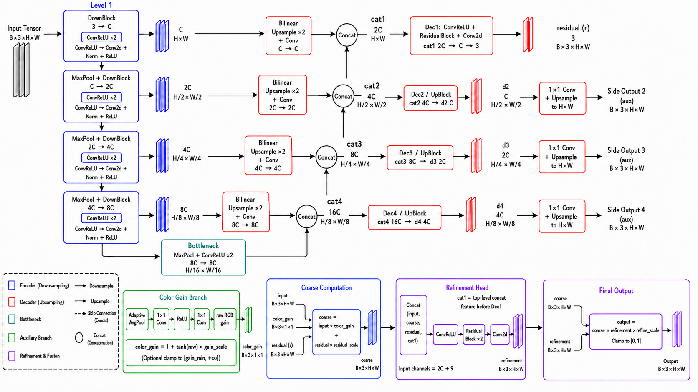
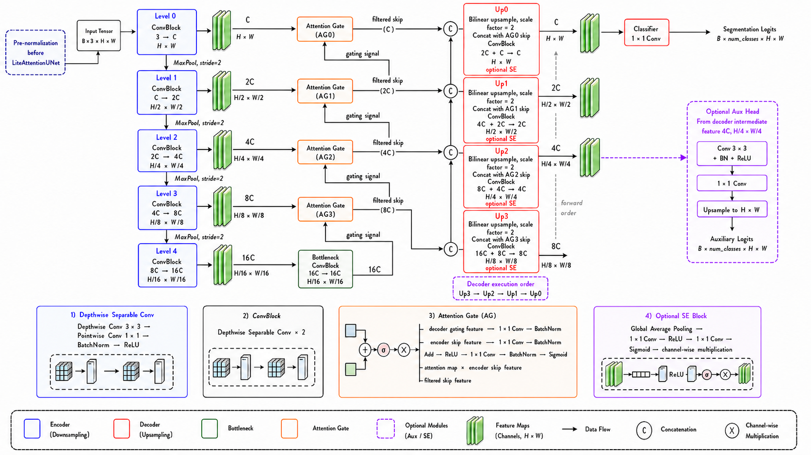

<div align="center">

# ColorAwareNet

**颜色增益引导的图像去雾与语义分割**

[English](README.md) · **简体中文**

[](pyproject.toml)
[](#installation)
[](#installation)
[](train.py)

[训练入口](train.py) · [数据下载](https://pan.baidu.com/s/18BtKG8-QHzRhfCGqjiuoUA?pwd=8888) · [GitHub Issues](https://github.com/dongfangshiwen/colorawarenet-joint-model/issues)

</div>

> **论文** · *A Color-Gain-Guided, Color-Preserving Joint Framework for Image Dehazing and Semantic Segmentation*

**快速导航：** [开始使用](#quick-start) · [安装](#installation) · [数据集](#datasets) · [方法](#method) · [训练](#training) · [评估](#prediction-and-evaluation) · [权重](#checkpoints) · [实验](#ablations-and-visualization) · [常见问题](#faq) · [引用](#citation)

ColorAwareUNet 通过 RGB 增益、空间残差与细化分支恢复颜色和细节；LiteAttentionUNet 使用深度可分离卷积与 attention gate，对去雾图进行语义分割。两个网络通过三阶段训练协同优化。

[](docs/assets/framework.png)

*论文图 2：联合框架的总体架构、训练流程与推理过程。点击图片可查看原始分辨率。*

| 训练 | 评估 | 分析 |
| :--- | :--- | :--- |
| 道路联合训练与五种去雾对比模型 | 道路数据、SOTS 与增强 HSTS | 注册式消融、增益图与组件可视化 |

本仓库公开源码、使用文档与论文中的网络架构图。数据和权重需在本地准备；论文全文与 notebook 不包含在代码发布中。

---

<a id="quick-start"></a>

## 快速开始

**训练入口是根目录的 [`train.py`](train.py)**，公共训练循环位于 [`dehaze_seg/engine/train.py`](dehaze_seg/engine/train.py)。

1. 完成[安装](#installation)，后续命令均在仓库根目录运行。
2. 下载 [datasets.zip](https://pan.baidu.com/s/18BtKG8-QHzRhfCGqjiuoUA?pwd=8888)，提取码 **8888**，按[数据目录说明](#datasets)解压。
3. 启动论文默认的 60 / 20 / 20 三阶段训练：

```bash
python train.py --dataset paired-road --data-root datasets --model coloraware --output runs/paper --device cuda --amp
```

训练完成后，用生成的权重预测一张图像：

```bash
python -m dehaze_seg predict --checkpoint runs/paper/paired-road/coloraware/best.pth --input datasets/hazy/001.png --output results/single
```

将 `001.png` 替换为实际图像文件名。训练示例通过 `--device cuda --amp` 明确使用 CUDA GPU 和混合精度；预测默认自动选择可用 GPU。较小规模的 CPU 流程检查见[训练说明](#training)；默认感知损失需要预训练 VGG16 权重，离线缓存方式见[常见问题](#faq)。

<a id="installation"></a>

## 安装

先克隆仓库并进入根目录，后续命令均在此目录运行：

```bash
git clone https://github.com/dongfangshiwen/colorawarenet-joint-model.git
cd colorawarenet-joint-model
```

建议使用与论文一致的 **Python 3.12**（项目最低要求为 Python 3.10），并创建独立虚拟环境。

```bash
python -m venv .venv
```

激活环境：Windows PowerShell 使用 `.venv\Scripts\Activate.ps1`；Linux 使用 `source .venv/bin/activate`。

### GPU 环境安装

论文第 4.1.3 节记录的环境为 **PyTorch 2.3.0、CUDA 12.1**。在具备 NVIDIA GPU 和兼容驱动的机器上，按 [PyTorch 官方版本表](https://pytorch.org/get-started/previous-versions/#v230)安装 CUDA 版 PyTorch 及对应的 torchvision：

```bash
python -m pip install torch==2.3.0 torchvision==0.18.0 --index-url https://download.pytorch.org/whl/cu121
python -m pip install -e . "numpy<2"
python -m dehaze_seg --help
```

这里将 NumPy 限制在 1.x，以避免旧版 PyTorch 环境中的二进制兼容问题；这是安装兼容约束，不是论文中记录的 NumPy 版本。说明见 [NumPy 官方兼容性指南](https://numpy.org/doc/stable/user/troubleshooting-importerror.html#downstream-importerror-attributeerror-or-c-api-abi-incompatibility)。

训练前检查 GPU 是否可用：

```bash
python -c "import torch; print('PyTorch:', torch.__version__); print('CUDA:', torch.version.cuda); print('GPU available:', torch.cuda.is_available()); assert torch.cuda.is_available(), 'CUDA GPU unavailable'; print('GPU:', torch.cuda.get_device_name(0))"
```

`--device cuda` 明确要求使用可见的 CUDA GPU，`--amp` 启用 GPU 混合精度。CLI 默认的 `--device auto` 在 CUDA 可用时自动选择 GPU。安装后也可使用 `dehaze-seg` 命令。

<details>
<summary><strong>用于本地流程检查的 CPU 安装方式</strong></summary>

在另一个独立虚拟环境中，可安装本机已验证的 CPU 组合：

```bash
python -m pip install torch==2.8.0 torchvision==0.23.0 --index-url https://download.pytorch.org/whl/cpu
python -m pip install -e .
```

运行[训练说明](#training)中的缩小规模示例，使用 `--device cpu`。这是本地验证环境，论文实验使用 GPU。

</details>

<details>
<summary><strong>论文环境与本机验证环境</strong></summary>

| 环境 | 说明 |
|---|---|
| 论文软件环境 | Ubuntu 22.04、Python 3.12、PyTorch 2.3.0、CUDA 12.1 |
| 论文云端硬件 | 1 张 32 GB vGPU、16 个 Intel Xeon Platinum 8352V vCPU、62 GB RAM |
| CPU 回归验证 | Windows、Python 3.12、PyTorch 2.8.0+cpu、torchvision 0.23.0 |

上述 GPU 配置来自论文记录。本次仓库整理的检查使用本机 CPU 环境，未重新验证 CUDA 运行和完整论文训练。依赖范围用于安装解析，不表示所有版本组合均经过测试。

</details>

<a id="datasets"></a>

## 数据集

个人训练数据：**datasets.zip**，共 185 组配对道路场景样本。

- [百度网盘下载](https://pan.baidu.com/s/18BtKG8-QHzRhfCGqjiuoUA?pwd=8888)
- 提取码：**8888**

自行下载并解压，使目录结构如下；`--data-root` 指向包含这三个子目录的文件夹：

```text
datasets/
├── hazy/       # 001.png, 002.png, ...
├── clear/      # 同名清晰图
└── masks/      # 同名分割标注
```

按文件主名配对，扩展名可以不同。图像使用 RGB；二分类标注为背景 0、道路 1，也支持灰度 0/255。标注缩放使用最近邻插值，几何增强同步作用于图像和标注。

默认先排序样本 ID，再以 Python 随机种子 42 打乱，按 0.15 划分验证集：**训练 157 组，验证 28 组，无独立测试集**。每次训练保存 `split.json`，后续道路评估优先使用该文件。

### 基准数据集

其他数据集需自行准备，不包含在上述道路数据分享中：

| `--dataset` | 目录与配对规则 |
|---|---|
| `sots-indoor` / `sots-outdoor` | `hazy/` 和 `clear/` 或 `gt/`；先匹配完整主名，再将 `1400_1` 匹配到 `1400` |
| `hsts` | `synthetic/synthetic/` 为雾图，`synthetic/original/` 为同名清晰图 |

这些入口默认只训练去雾，不生成分割标签。HSTS 保留同步裁剪、翻转和旋转增强，`--train-repeats` 控制每轮重复次数；增强 HSTS 衍生数据实验不能作为未修改官方 HSTS 协议的结果。HSTS 的无参考真实图像可直接通过 `predict --input` 推理，不计算全参考指标。

<a id="method"></a>

## 方法与模型

<details>
<summary><strong>展开论文中的两个分支网络架构图</strong></summary>

**图 3 · ColorAwareUNet：** 全局 RGB 增益、残差预测与细化模块。

[](docs/assets/colorawareunet.png)

**图 4 · LiteAttentionUNet：** 轻量卷积、attention gate 与可选 SE 模块。

[](docs/assets/liteattentionunet.png)

以上图片直接取自提供的 Word 论文，点击可查看原始分辨率。可选模块的默认开关见下方配置表。

</details>

### 支持的模型

| 名称 | 内容 |
|---|---|
| `coloraware` | 论文主去雾模型 ColorAwareUNet |
| `c2pnet` | 仓库中的 C2PNet 实现 |
| `dcp` | DCP 加可训练细化分支；当前默认会启用细化，不能视为纯经典 DCP |
| `ffanet` | 仓库中的 FFA-Net 实现 |
| `grid` | 仓库中的 GridDehazeNet 实现 |
| `psd` | 仓库中的 PSDDehazeNet 实现 |

论文第 4.1.5 节的下游比较要求各去雾方法**共用同一个冻结的 LiteAttentionUNet 权重**，不针对各方法单独微调分割器。对比模型保留本仓库已有实现与参数，不宣称与原作者官方代码、权重或结果完全一致。

### 论文主配置

| 参数 | 默认值 |
|---|---|
| 去雾基础通道 | 32 |
| 增益 | global、tanh、scale=0.30、min=0.95，有效范围 [0.95, 1.30] |
| 残差 / 细化系数 | 0.50 / 0.25 |
| 分割 | 2 类、基础通道 32、width multiplier=1.0 |
| Attention / SE / 辅助头 | 开 / 关 / 关 |
| ImageNet 归一化 | 开 |
| 输入尺寸 / batch size | 512×512 / 2 |
| 优化器 | AdamW，lr=1e-4，weight decay=1e-5 |
| 三阶段轮数 | 60 / 20 / 20 |

### 训练目标

```text
去雾：L1 + 0.40 × SSIM_loss + 0.05 × VGG_perceptual
分割：CE + soft Dice
联合：去雾损失 + 分割损失
```

去雾损失为 `L1 + 0.40 × SSIM_loss + 0.05 × VGG_perceptual`；SSIM 使用 11×11 均值窗口，损失为 `(1 − SSIM) / 2`。感知损失使用冻结的 ImageNet VGG16 第 3、8、15 层特征。分割损失为 CE＋类别平均 soft Dice，联合阶段两项任务权重均为 1。

MSE、梯度差、ΔSat 和 CRerr 不参与默认优化；侧输出只用于兼容和可视化。局部增益与只放大增益属于消融设置。全局增益贡献热图表示 `mean(abs(input × (gain−1)))`，不是空间增益图。

### 论文组件与代码对应

| 组件 | 源码 |
| :--- | :--- |
| RGB 增益、残差与细化 | [`ColorAwareUnet.py`](dehaze_seg/models/ColorAwareUnet.py) |
| Attention 分割网络 | [`LiteAttentionUnet.py`](dehaze_seg/models/LiteAttentionUnet.py) |
| 联合网络与输出适配 | [`joint.py`](dehaze_seg/models/joint.py) · [`registry.py`](dehaze_seg/models/registry.py) |
| 训练目标 | [`losses.py`](dehaze_seg/losses.py) |
| 三阶段优化 | [`engine/train.py`](dehaze_seg/engine/train.py) |
| 消融配置 | [`ablations.py`](dehaze_seg/experiments/ablations.py) |

<a id="training"></a>

## 训练

`python train.py` 与 `python -m dehaze_seg train` 接受相同参数，无需在 `train.py` 后重复添加 `train`。使用 `python train.py --help` 查看完整选项。

### 三阶段训练

| 阶段 | 轮数 | 更新参数 | 优化目标 |
| :--- | :---: | :--- | :--- |
| 1 · 去雾预训练 | **60** | ColorAwareUNet | 去雾损失 |
| 2 · 分割训练 | **20** | LiteAttentionUNet；冻结去雾器 | 分割损失 |
| 3 · 联合微调 | **20** | 两个网络 | 两项损失之和 |

### 道路数据联合训练

```bash
python train.py --dataset paired-road --data-root datasets --model coloraware --output runs/paper --device cuda --amp
```

<details>
<summary><strong>展开论文主配置的完整命令</strong></summary>

```bash
python train.py --dataset paired-road --data-root datasets --model coloraware --pretrain-dehaze-epochs 60 --pretrain-seg-epochs 20 --finetune-epochs 20 --resize 512 512 --batch-size 2 --lr 1e-4 --output runs/paper-explicit --device cuda --amp
```

</details>

<details>
<summary><strong>展开较小规模的 CPU 流程检查</strong></summary>

该命令将输入缩小至 64×64，每阶段运行 1 轮，并显式关闭感知损失以避免下载 VGG 权重。它会读取已准备的数据集并生成独立结果，用于检查环境与流程，不用于复现论文指标。

```bash
python train.py --data-root datasets --device cpu --resize 64 64 --batch-size 2 --pretrain-dehaze-epochs 1 --pretrain-seg-epochs 1 --finetune-epochs 1 --lam-perc 0 --output runs/smoke --no-plots
```

</details>

### 对比模型

通过 `--model` 选择保留的去雾对比模型，开展可选的联合训练实验：

```bash
python train.py --dataset paired-road --data-root datasets --model c2pnet --output runs/comparison --device cuda --amp
```

该命令会为本次训练单独训练分割器。论文第 4.1.5 节的下游比较需要将所有去雾器接入同一个冻结分割器进行评估；独立联合训练的结果应作为单独实验报告。

<details>
<summary><strong>展开 SOTS 与增强 HSTS 命令</strong></summary>

```bash
python train.py --dataset sots-indoor --data-root SOTS/indoor --model coloraware --resize 512 512 --batch-size 2 --lr 1e-4 --output runs/sots --device cuda --amp
python train.py --dataset sots-outdoor --data-root SOTS/outdoor --model coloraware --resize 512 512 --batch-size 2 --lr 1e-4 --output runs/sots --device cuda --amp
python train.py --dataset hsts --data-root HSTS --train-repeats 4 --output runs/hsts --device cuda --amp
```

基准数据集只执行 `--pretrain-dehaze-epochs`，使用去雾监督。示例采用论文记载的 512×512 输入和 1e-4 学习率，batch size 2 与去雾 60 轮沿用仓库默认配置。HSTS 使用配对增强，`--train-repeats 4` 为可调整的重复次数示例。

</details>

### 常用参数

| 选项 | 用途 / 默认值 |
| :--- | :--- |
| `--pretrain-dehaze-epochs`、`--pretrain-seg-epochs`、`--finetune-epochs` | 三阶段轮数：60 / 20 / 20 |
| `--resize H W`、`--batch-size` | 输入尺寸与批大小：512 512 / 2 |
| `--seed`、`--val-ratio` | 划分种子与验证比例：42 / 0.15 |
| `--device`、`--amp` | `auto`、`cpu` 或 `cuda`；按需启用 CUDA 混合精度 |
| `--workers`、`--threads` | 数据加载进程：0；CPU 线程：4 |
| `--use-se`、`--no-attention`、`--no-imagenet-norm` | 修改分割网络的默认配置 |
| `--output` | 新实验的输出父目录 |

### 训练输出

```text
runs/paper/paired-road/coloraware/
├── config.json          # 完整模型、训练和实验配置
├── split.json           # 实际训练/验证样本 ID
├── metrics.csv
├── final_metrics.json   # 最后一轮模型的验证指标
├── dehaze/{best,last}.pth
├── seg/{best,last}.pth
├── joint/{best,last}.pth
├── best.pth             # 最后一个已执行阶段的最优模型
├── last.pth             # 最后一个已执行阶段的末轮模型
└── plots/
```

阶段按前一阶段的末轮参数继续训练。去雾阶段以 PSNR、分割阶段以 mIoU 选择最优权重；联合阶段默认使用 `PSNR/30 + SSIM + mIoU + F1`，可用 `--score-metric` 修改。输出目录已有训练结果时需使用新的 `--output`，避免覆盖。当前 CLI 不提供断点续训。

<a id="prediction-and-evaluation"></a>

## 推理与评估

### 单图与批量预测

```bash
python -m dehaze_seg predict --checkpoint runs/paper/paired-road/coloraware/best.pth --input datasets/hazy/001.png --output results/single
python -m dehaze_seg predict --checkpoint runs/paper/paired-road/coloraware/best.pth --input datasets/hazy --output results/batch
```

输出包括去雾图、类别编号 PNG、分割叠加图和拼图；纯去雾权重只输出去雾结果。预测保留原图尺寸，内部补齐至 16 的倍数；可用 `--resize H W` 降低推理开销，结果会插值回原尺寸。

### 数据集评估

```bash
python -m dehaze_seg evaluate --checkpoint runs/paper/paired-road/coloraware/best.pth --dataset paired-road --data-root datasets --split val --output results/road-eval
python -m dehaze_seg evaluate --checkpoint runs/sots/sots-indoor/coloraware/best.pth --dataset sots-indoor --data-root SOTS/indoor --split all --output results/sots-eval
```

道路评估默认 `val`，其他数据集默认 `all`。可通过 `--split-file` 指定保存的划分。旧权重无划分文件时，按保存的 seed/val_ratio 重建；重建要求数据集合保持一致。训练时对 SOTS 的内部划分用于监控，按雾图 ID 划分而非按场景分组，不能将其称为独立标准测试结果。

`--metric-align crop` 默认将尺寸不一致的预测与参考图中心裁剪到共同区域；`resize` 将参考图缩放到预测尺寸；`none` 要求尺寸完全相同。训练保持原有数据预处理方式，评估默认原尺寸，因此训练日志与原尺寸评估结果可能不同。

评估保存逐图 `metrics.csv` 和汇总 `summary.json`。恢复指标按图平均，分割指标由全数据混淆矩阵计算。与旧脚本相比，验证 PSNR 改为逐图平均，不再先按 batch 混合 MSE，以避免 batch size 改变汇总值。`--save-images` 保存评估图片，`--limit 1` 可只检查一张。

### 多模型比较

多个权重可在同一命令中比较，生成各自结果、汇总表和对比拼图：

```bash
python -m dehaze_seg predict --checkpoint runs/paper/paired-road/coloraware/best.pth runs/comparison/paired-road/c2pnet/best.pth --input datasets/hazy --limit 5 --output results/comparison
```

此命令使用各联合权重自身保存的分割器，不会自动替换为论文下游比较协议要求的共用冻结分割器。

<a id="checkpoints"></a>

## 权重加载

新权重保存完整 `model_config`，加载时自动恢复结构和数值配置。支持历史 `model_state`、`model_state_dict`、`state_dict`、`dehazer_state` 字典，以及常见外层前缀。历史联合训练权重中保存的 `args` 会映射为论文训练配置。

```bash
python -m dehaze_seg predict --checkpoint weights/colorawareunet.pth --input datasets/hazy/001.png --resize 512 512 --output results/legacy
```

上述权重路径仅表示已有的本地文件，仓库不附带权重下载。无配置的裸参数文件需要明确选择历史设置：

```bash
python -m dehaze_seg predict --checkpoint weights/raw.pth --model coloraware --legacy-profile paper --input datasets/hazy/001.png --output results/raw
```

`paper` 使用论文默认配置，`legacy-infer` 对应旧通用推理入口的默认配置（例如 ColorAwareUNet gain=0.65、无 gain 下限）。对于其他历史结构，用 `--model-config model.json` 提供完整模型配置；格式与训练 `config.json` 中的 `model_config` 对象一致。结构不匹配会明确报错，不会部分加载后继续推理。旧模块路径和旧命令入口不再保留。

<a id="ablations-and-visualization"></a>

## 消融与可视化

### 注册式消融

```bash
python -m dehaze_seg ablate --list
```

<details>
<summary><strong>展开结构、增益与注意力消融命令</strong></summary>

```bash
python -m dehaze_seg ablate --data-root datasets --experiments arch_baseline_unet,arch_no_color_gain,arch_no_refine,arch_full --output runs/ablation --device cuda --amp
python -m dehaze_seg ablate --data-root datasets --experiments gain_local,gain_amp,gain_no_min --output runs/gain-ablation --device cuda --amp
python -m dehaze_seg ablate --data-root datasets --experiments attention_none,attention_gate,attention_se,attention_both --output runs/attention-ablation --device cuda --amp
```

</details>

还提供训练策略、损失、模型容量、数据增强、输入归一化和直接雾图分割实验。`--experiments all` 运行完整注册表。所有消融共享训练流程、随机划分和指标；结果按实验名称保存，并汇总到 `ablation_summary.csv`。

### 可视化

```bash
python -m dehaze_seg visualize gain --checkpoint runs/paper/paired-road/coloraware/best.pth --data-root datasets --samples 001 --output-dir results/color_gain
python -m dehaze_seg visualize components --checkpoint runs/paper/paired-road/coloraware/best.pth --data-root datasets --sample 001 --output-dir results/components
python -m dehaze_seg visualize curves --metrics runs/paper/paired-road/coloraware/metrics.csv --output results/curves
python -m dehaze_seg visualize introduction --data-root datasets --sample 001 --visualization-dir results/color_gain --output-dir results/figures
```

增益和组件可视化要求联合 ColorAwareUNet 权重。Introduction 拼图使用前一步生成的相同 sample 结果。各子命令可通过 `--help` 查看选项。

<a id="project-structure"></a>

## 代码结构

```text
train.py             # 直接训练入口
dehaze_seg/
├── models/          # 论文模型、对比模型、输出适配与统一注册表
├── data/            # 道路三元组和各基准配对/增强
├── losses.py        # 去雾与分割目标
├── metrics.py       # 图像质量、颜色与分割指标
├── engine/          # train.py 训练实现、评估、推理和权重加载
├── experiments/     # 显式消融配置与执行
├── visualization/   # 曲线、增益、组件及论文拼图
└── cli.py           # 公开命令入口
tools/               # 可选标注、合成雾与文件整理工具
tests/               # CPU 回归检查
```

统一入口 `python -m dehaze_seg` 或安装后的 `dehaze-seg` 提供 `train`、`predict`、`evaluate`、`ablate`、`visualize` 五个子命令。可选标注和数据整理工具见[工具说明](tools/README.zh-CN.md)。Git 忽略本地数据、权重、生成结果、论文文件和 notebook，正常跟踪源码与测试。

<a id="validation"></a>

## 验证范围

```bash
python -m unittest discover -s tests -v
```

在[安装说明](#installation)列出的本机环境中，**11 项 CPU 回归测试通过**，覆盖模型前向、增益/attention/SE 变体、数据配对、同步增强、阶段冻结、参数更新与权重保存/重载。测试不会下载数据或 VGG 权重。

另已检查 185 组道路三元组、小样本三阶段训练、推理/评估/消融/可视化流程，以及现有历史权重的推理。**尚未验证 CUDA 运行与论文完整训练**，这里不提供未经复现的成绩。

<a id="faq"></a>

## 常见问题

<details>
<summary><strong>VGG 下载失败</strong></summary>

默认感知损失需要 `vgg16-397923af.pth`，放在 `TORCH_HOME/hub/checkpoints/` 缓存中；未设置 `TORCH_HOME` 时通常为 `~/.cache/torch/hub/checkpoints/`。也可显式 `--lam-perc 0` 做无感知损失实验，不能将其当作论文完整目标。

</details>

<details>
<summary><strong>CPU 很慢或显存不足</strong></summary>

缩小 `--batch-size`、`--resize`；CPU 可调整 `--threads`。缩小训练尺寸会改变实验设置。

</details>

<details>
<summary><strong>找不到数据</strong></summary>

检查解压后是否多嵌套了一层 `datasets/`，并核对文件主名和目录名。

</details>

<details>
<summary><strong>模型不匹配</strong></summary>

提供正确旧配置或对应权重，不要通过非严格加载掩盖结构差异。

</details>

<a id="citation"></a>

## 论文与引用

本仓库对应页首论文的方法实现。实验结论与评估协议请以最终论文为准；回归测试不能替代完整复现实验。以下条目用于引用软件仓库，论文正式发表后请同时使用出版社提供的论文引用信息。

```bibtex
@misc{colorawarenet_joint_model,
  title = {ColorAwareNet Joint Model: Color-Gain-Guided Image Dehazing and Semantic Segmentation},
  howpublished = {GitHub repository},
  url = {https://github.com/dongfangshiwen/colorawarenet-joint-model}
}
```

问题反馈请提交至 [GitHub Issues](https://github.com/dongfangshiwen/colorawarenet-joint-model/issues)，并附上运行命令、环境版本与错误日志。

---

<div align="center">

[返回顶部](#colorawarenet) · [English](README.md)

</div>
